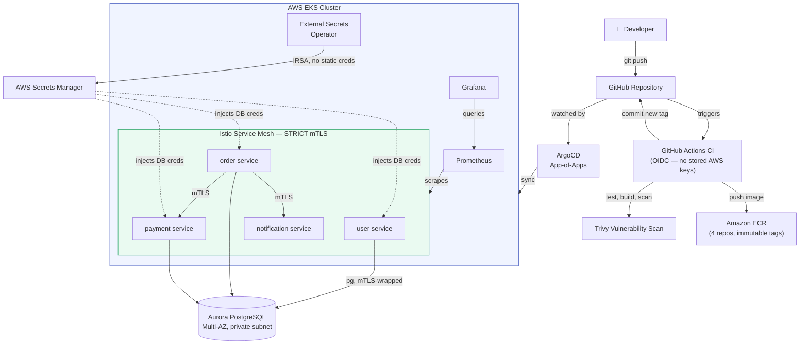
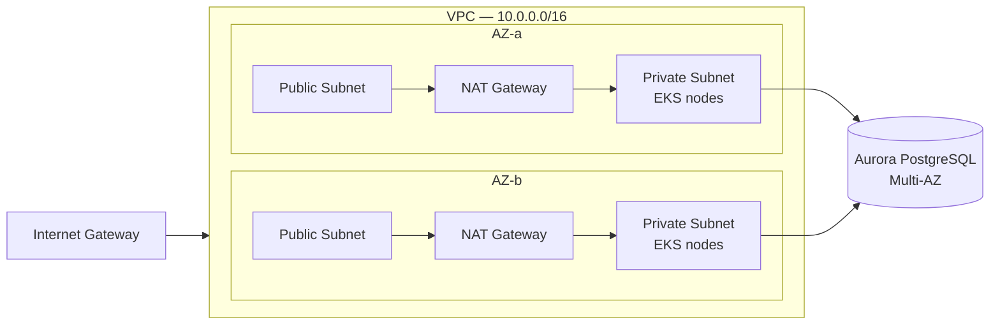
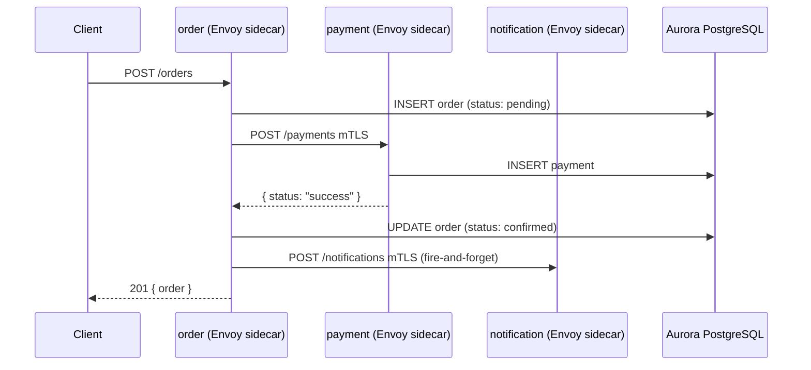
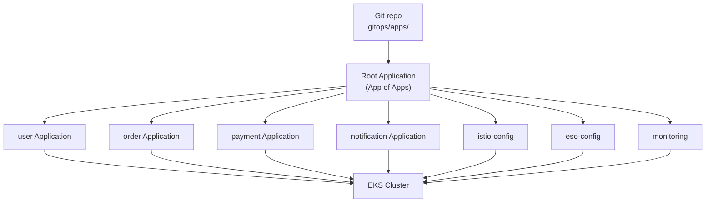
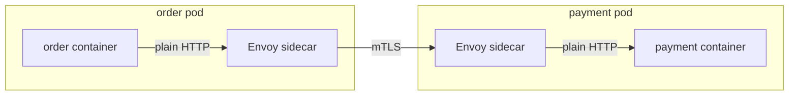
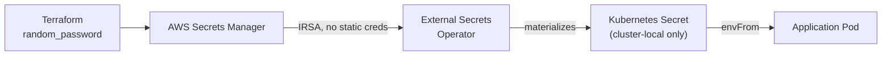

# Microservices on Kubernetes — End-to-End CI/CD with GitOps

A production-style, four-service microservices platform deployed on **AWS EKS**, built from scratch with **Terraform**, delivered through a **GitHub Actions → Amazon ECR → ArgoCD (GitOps)** pipeline, secured with **Istio mutual TLS** and **OIDC-federated IAM roles (no static AWS keys anywhere)**, backed by **real Aurora PostgreSQL** via **External Secrets Operator**, and observed with **Prometheus + Grafana**.

This project was built to demonstrate practical, hands-on DevOps engineering — not just "I used tool X," but _why_ each tool was chosen, what problem it solves, and how the pieces are wired together in a way that mirrors how this stack would actually run in production.

> **TL;DR for recruiters:** This is a real, running system — not a tutorial clone. Every component below was deployed, broken, debugged, and verified against live AWS infrastructure. Verification evidence (mTLS rejection proof, pod-restart persistence proof, CI failure gates) is documented in [Verification & Proof](#verification--proof-this-actually-works).

---

## Table of Contents

- [Architecture Overview](#architecture-overview)
- [Tech Stack](#tech-stack)
- [Repository Structure](#repository-structure)
- [How It All Fits Together](#how-it-all-fits-together)
  - [1. Infrastructure — Terraform](#1-infrastructure--terraform)
  - [2. The Microservices](#2-the-microservices)
  - [3. CI/CD Pipeline — GitHub Actions](#3-cicd-pipeline--github-actions)
  - [4. GitOps Delivery — ArgoCD](#4-gitops-delivery--argocd)
  - [5. Service Mesh Security — Istio mTLS](#5-service-mesh-security--istio-mtls)
  - [6. Secrets Management — External Secrets Operator](#6-secrets-management--external-secrets-operator)
  - [7. Observability — Prometheus & Grafana](#7-observability--prometheus--grafana)
- [Security Design Decisions](#security-design-decisions)
- [Verification & Proof This Actually Works](#verification--proof-this-actually-works)
- [Running Locally](#running-locally)
- [Deploying From Scratch](#deploying-from-scratch)
- [Design Decisions & Tradeoffs](#design-decisions--tradeoffs)
- [What I'd Improve With More Time](#what-id-improve-with-more-time)
- [Skills Demonstrated](#skills-demonstrated)

---

## Architecture Overview



**In one sentence:** every code change is tested, scanned for vulnerabilities, containerized, pushed to a private registry, and deployed to a live Kubernetes cluster automatically — with zero long-lived credentials anywhere in the pipeline, encrypted service-to-service traffic, and real persistent storage.

---

## Tech Stack

| Layer                       | Technology                                                      | Purpose                                                 |
| --------------------------- | --------------------------------------------------------------- | ------------------------------------------------------- |
| **Cloud Provider**          | AWS (EKS, RDS Aurora, ECR, Secrets Manager, IAM, VPC)           | Compute, database, registry, secrets, networking        |
| **Infrastructure as Code**  | Terraform (modular, remote S3 + native-lock state)              | Repeatable, version-controlled infra                    |
| **Container Orchestration** | Kubernetes (Amazon EKS 1.30)                                    | Running and scaling the services                        |
| **Service Mesh**            | Istio (STRICT mTLS)                                             | Encrypted, authenticated service-to-service traffic     |
| **CI**                      | GitHub Actions (OIDC federation, matrix builds, path filtering) | Test, build, vulnerability-scan, push                   |
| **CD**                      | ArgoCD (App-of-Apps pattern, automated sync + self-heal)        | GitOps-based, pull-based deployment                     |
| **Container Registry**      | Amazon ECR (immutable tags, lifecycle policies, scan-on-push)   | Secure image storage                                    |
| **Secrets Management**      | External Secrets Operator + AWS Secrets Manager (IRSA)          | Zero secrets committed to Git or hardcoded in manifests |
| **Database**                | Aurora PostgreSQL (Multi-AZ, private subnet)                    | Real relational persistence, not in-memory mocks        |
| **Observability**           | Prometheus + Grafana (kube-prometheus-stack)                    | Metrics, dashboards, cluster health                     |
| **Application Runtime**     | Node.js 20 + Express (all 4 services)                           | Lightweight, consistent microservice runtime            |
| **Language**                | JavaScript (raw `pg` driver — no ORM, by design)                | Transparent, auditable data-access code                 |

---

## Repository Structure

```
microservices-k8s-cicd/
├── services/                  # 4 independent Node.js microservices
│   ├── user/                  #   - user profile CRUD
│   ├── order/                 #   - order orchestration (calls payment + notification)
│   ├── payment/                #   - payment processing (decline-threshold logic)
│   └── notification/          #   - fire-and-forget notifications
│
├── infra/                     # Terraform, fully modular
│   ├── bootstrap/              #   - one-time S3 state bucket (created before everything else)
│   ├── modules/
│   │   ├── vpc/                #   - VPC, public/private subnets, NAT, route tables
│   │   ├── eks/                #   - EKS cluster, node group, cluster OIDC provider (IRSA)
│   │   ├── ecr/                #   - 4 immutable-tag ECR repos with lifecycle policies
│   │   ├── oidc/                #   - GitHub Actions OIDC provider
│   │   ├── github-actions-role/ #  - IAM role CI assumes (trust-policy scoped to this repo/branch)
│   │   ├── rds/                #   - Aurora PostgreSQL cluster + Secrets Manager credential
│   │   ├── eso-irsa/            #   - IAM role for External Secrets Operator (IRSA)
│   │   └── monitoring-secrets/ #   - Grafana admin credential in Secrets Manager
│   └── environments/dev/       #   - the environment that wires all modules together
│
├── k8s/                        # Raw Kubernetes manifests (Deployment/Service/ConfigMap per service)
│   ├── user/ order/ payment/ notification/
│   ├── istio/                  #   - PeerAuthentication (STRICT mTLS)
│   └── eso/                    #   - ClusterSecretStore + ExternalSecrets
│
├── gitops/                     # ArgoCD Application definitions (the "App of Apps")
│   ├── root-app.yaml            #   - the one Application you apply manually, ever
│   └── apps/                   #   - one Application per service/component
│
├── .github/workflows/ci.yml    # The entire CI/CD pipeline
└── docker-compose.yml          # Spin up all 4 services locally in one command
```

---

## How It All Fits Together

### 1. Infrastructure — Terraform

Everything in AWS is provisioned by Terraform, split into small, single-responsibility modules rather than one giant file. This mirrors how infrastructure is organized in real engineering teams — each module can be tested, reused, and reasoned about independently.

**Key design decisions:**

- **Remote state in S3**, with native S3 locking — no local `terraform.tfstate` ever committed, no two people (or CI + a human) able to corrupt state by applying simultaneously.
- **VPC**: 2 Availability Zones, public + private subnets, **one NAT Gateway per AZ** (not a single shared NAT) — a deliberate high-availability choice: if one AZ goes down, the other's private subnet still has an independent path to the internet.
- **EKS**: a managed node group with an explicit IAM role carrying exactly the three policies nodes need (`AmazonEKSWorkerNodePolicy`, `AmazonEKS_CNI_Policy`, `AmazonEC2ContainerRegistryReadOnly`) — nothing more.
- **Two separate OIDC providers**, easy to conflate but conceptually distinct:
  - The **EKS cluster's own OIDC issuer** → powers **IRSA** (IAM Roles for Service Accounts), letting individual Kubernetes pods assume scoped AWS IAM roles.
  - **GitHub's OIDC issuer** (`token.actions.githubusercontent.com`) → lets GitHub Actions workflow runs assume an AWS IAM role **without ever storing an AWS access key as a GitHub secret**.
- **RDS**: Aurora PostgreSQL, Multi-AZ, in private subnets only, with a security group that allows inbound Postgres traffic **only from the EKS node security group** (identity-based access control, not IP-range-based).
- **ECR**: `image_tag_mutability = IMMUTABLE` — once an image is tagged with a commit SHA, that tag can never be overwritten. This is what makes GitOps rollback (`git revert`) actually trustworthy.



### 2. The Microservices

Four services, deliberately built on the **same stack (Node.js + Express)** rather than a different language per service. This was a conscious choice: the goal of this project is to demonstrate DevOps and platform engineering depth, not backend-language breadth. Keeping the application layer simple and consistent means the _infrastructure and delivery pipeline_ is where the real engineering complexity.

| Service          | Responsibility                 | Notable Design Choice                                                                                                                         |
| ---------------- | ------------------------------ | --------------------------------------------------------------------------------------------------------------------------------------------- |
| **user**         | User CRUD, backed by Postgres  | Parameterized SQL queries only — no string interpolation, closing off SQL injection entirely                                                  |
| **order**        | Orchestrates the purchase flow | Writes an order as `pending` _before_ calling payment — guarantees the order record survives even if a downstream call fails or times out     |
| **payment**      | Simulated payment processing   | Deterministic decline logic (amount over a threshold) rather than random — keeps automated tests reliable, not flaky                          |
| **notification** | Fire-and-forget notifications  | Deliberately **not** persisted to Postgres — notifications are transient by nature; adding a DB write here would be complexity without payoff |

Each service:

- Has a **multi-stage Dockerfile** (separate build/production stages, runs as a **non-root user**, includes a container-level `HEALTHCHECK`)
- Has real **Jest unit tests** (with `pg` and outbound HTTP calls mocked via `jest.mock` / `nock` — tests never depend on live infrastructure)
- Exposes `/health` for Kubernetes liveness/readiness probes



### 3. CI/CD Pipeline — GitHub Actions

```mermaid
flowchart LR
    Trigger["Push / PR to main"] --> Detect["detect-changes<br/>(paths-filter)"]
    Detect -->|only changed services| Matrix["Matrix: build-test-scan-push<br/>(runs per service, in parallel)"]
    Matrix --> Test["npm ci && npm test"]
    Test --> Build["docker build<br/>tag: commit SHA"]
    Build --> Scan["Trivy scan<br/>blocks on CRITICAL/HIGH CVEs"]
    Scan -->|main branch only| Push["Push to ECR"]
    Push --> Update["update-manifest<br/>commits new image tag [skip ci]"]
```



**Why this design, not the simplest possible pipeline:**

- **Path-filtered matrix builds** — a 4-service monorepo doesn't rebuild every service on every commit. `dorny/paths-filter` detects exactly which `services/<name>/**` paths changed, and only those services enter the build matrix. Touch `payment`, only `payment` builds.
- **OIDC, not static AWS keys** — the workflow authenticates to AWS via `aws-actions/configure-aws-credentials` using `sts:AssumeRoleWithWebIdentity`. GitHub mints a short-lived, cryptographically signed token proving "this run is really `<org>/<repo>` on `main`"; AWS verifies it against an IAM trust policy scoped to that exact repo and branch. **No AWS access key is ever stored as a GitHub secret.**
- **Trivy is a hard gate, not a report** — `exit-code: 1` means the pipeline genuinely fails the build on CRITICAL/HIGH vulnerabilities. This isn't a "nice to have" scan step; it blocks the merge.
- **The push step only runs on `push` to `main`, never on PRs** — this is enforced twice: once in the workflow's `if:` condition, and again structurally by the IAM trust policy itself (which only trusts tokens with `sub: repo:.../.../ref:refs/heads/main`). Even a maliciously modified workflow file on a PR branch couldn't push to ECR, because the AWS side would refuse to hand over credentials.
- **`update-manifest` closes the GitOps loop** — after a successful push, CI edits `k8s/<service>/deployment.yaml` to point at the new commit-SHA-tagged image and commits that change back to `main` (with `[skip ci]` to avoid an infinite trigger loop). This commit is what ArgoCD actually watches for.

### 4. GitOps Delivery — ArgoCD



A single `kubectl apply -f gitops/root-app.yaml` is the **only manual deployment command ever run**. From that point forward, the root Application watches `gitops/apps/`, and everything it finds there — one Application per service or platform component — is applied automatically. Adding a new service to this project means adding one more small YAML file, not touching a deployment script.

Every Application runs with:

```yaml
syncPolicy:
  automated:
    prune: true # deleted-from-Git resources are deleted from the cluster too
    selfHeal: true # manual kubectl edits are automatically reverted back to match Git
```

`selfHeal: true` is the property that makes Git the actual, enforced source of truth — not just documentation of intent. If someone manually patches a running Deployment, ArgoCD reverts it within seconds. Rollback is `git revert`, not a manual `kubectl` command against a live cluster.

### 5. Service Mesh Security — Istio mTLS

Istio's sidecar proxy (Envoy) is injected into every pod in the `microservices` namespace. Application code is completely unaware of this — `order` still calls `http://payment` exactly as it would without a mesh. Istio transparently intercepts that traffic, and with:

```yaml
apiVersion: security.istio.io/v1
kind: PeerAuthentication
metadata:
  name: default
  namespace: microservices
spec:
  mtls:
    mode: STRICT
```

...every connection between sidecars is mutually authenticated and encrypted, and **any connection that isn't mTLS-wrapped is rejected outright** — not logged as a warning, actually refused at the TLS handshake.



### 6. Secrets Management — External Secrets Operator

No secret — RDS credentials, Grafana admin password — is ever stored in a Kubernetes Secret manifest, a `.tfvars` file, or committed to Git. The flow:



- Terraform generates the credential with `random_password` and writes it directly into AWS Secrets Manager — it's never typed by a human, never appears in a `tfvars` file.
- External Secrets Operator authenticates to AWS via **IRSA** (its Kubernetes ServiceAccount is annotated with an IAM role ARN; EKS's identity webhook handles the token exchange) — again, no static AWS key anywhere.
- ESO's IAM permission is scoped to `secretsmanager:GetSecretValue` on `arn:...:secret:<project>/*` only — it cannot read any other secret in the AWS account.
- The resulting Kubernetes `Secret` is consumed by pods via `envFrom: secretRef`, exactly like any other Kubernetes-native secret — but its actual source of truth is Secrets Manager, and it's never hand-edited or Git-committed.

### 7. Observability — Prometheus & Grafana

Deployed via the `kube-prometheus-stack` Helm chart (through ArgoCD, like everything else), with explicit, modest resource requests/limits set on every component — this was a deliberate sizing decision to fit comfortably on a 2-node `t3.medium` cluster without needing to scale up infrastructure just to observe it.

Live dashboards show real data: CPU/memory per pod in the `microservices` namespace, cluster-wide resource usage, and (via node-exporter + kube-state-metrics) full node and workload health — all correlated against real traffic generated by exercising the `order → payment → notification` flow.

---

## Security Design Decisions

| Decision                                                                                                         | Why                                                                                                                                                                                               |
| ---------------------------------------------------------------------------------------------------------------- | ------------------------------------------------------------------------------------------------------------------------------------------------------------------------------------------------- |
| **No static AWS credentials anywhere** — CI and every in-cluster AWS-calling component (ESO) use OIDC federation | Eliminates an entire class of credential-leak risk; every credential is short-lived and scoped to a specific caller                                                                               |
| **IAM least privilege everywhere**                                                                               | The GitHub Actions role can only push to this project's 4 ECR repos. ESO can only read this project's secrets. RDS security group only accepts traffic from EKS nodes, by identity, not IP range. |
| **Istio STRICT mTLS**                                                                                            | Every service-to-service call is encrypted and mutually authenticated, verified by deliberately sending unauthenticated traffic and confirming it's rejected (see below)                          |
| **Trivy as a hard CI gate**                                                                                      | CRITICAL/HIGH vulnerabilities block the pipeline outright, not just generate a report someone might ignore                                                                                        |
| **Parameterized SQL everywhere**                                                                                 | No string-interpolated queries anywhere in the codebase — closes off SQL injection by construction                                                                                                |
| **Secrets never committed to Git**                                                                               | Every credential (DB, Grafana) is generated by Terraform and delivered to the cluster via External Secrets Operator, never hand-typed into a YAML file                                            |

---

## Verification & Proof This Actually Works

This project was verified against live infrastructure at every stage, not just "should work in theory."

**1. mTLS is actually enforced, not just configured:**

```bash
$ istioctl x describe pod order-xxxx -n microservices
Effective PeerAuthentication:
   Workload mTLS mode: STRICT
```

A pod deliberately created _without_ an Istio sidecar (`sidecar.istio.io/inject: "false"`) attempting a plain HTTP call to `payment` was rejected outright:

```bash
$ curl -s -o /dev/null -w "%{http_code}" http://payment/health
000   # connection refused at the TLS handshake — not a 403, a hard rejection
```

**2. Data genuinely persists in Postgres, not pod memory:**

```bash
$ curl -X POST http://localhost:3000/users -d '{"name":"Vinay","email":"vinay@example.com"}'
{"id":"7d0551b2-...", ...}

$ kubectl delete pod -n microservices -l app=user   # kill both replicas
$ curl http://localhost:3000/users
[{"id":"7d0551b2-...","name":"Vinay", ...}]   # data survived the pod restart
```

**3. The pipeline genuinely blocks bad code:**
A commit with a failing test, or a dependency with a known CRITICAL CVE, fails the `build-test-scan-push` job outright — the image is never built, never pushed, and `update-manifest` never runs. ArgoCD never sees a new tag, so the cluster stays on the last good version.

---

## Running Locally

```bash
docker compose up --build
```

Spins up all 4 services with correct inter-service DNS (`http://payment`, `http://notification`), matching how Kubernetes Service DNS resolves in the real cluster.

```bash
curl -X POST http://localhost:3001/orders \
  -H "Content-Type: application/json" \
  -d '{"userId":"u1","item":"widget","amount":250}'
```

## Deploying From Scratch

```bash
# 1. Bootstrap remote Terraform state (one-time)
cd infra/bootstrap && terraform init && terraform apply

# 2. Provision all infrastructure
cd ../environments/dev && terraform init && terraform apply

# 3. Point kubectl at the new cluster
aws eks update-kubeconfig --name microservices-cicd-cluster --region ap-south-1

# 4. Install ArgoCD
kubectl create namespace argocd
kubectl apply -n argocd -f https://raw.githubusercontent.com/argoproj/argo-cd/stable/manifests/install.yaml

# 5. Hand off everything else to GitOps
kubectl apply -f gitops/root-app.yaml
```

From step 5 onward, every future change is a `git push` — no manual `kubectl apply` against application workloads, ever.

---

## Design Decisions & Tradeoffs

Honest, interview-ready reasoning for the choices made in this project:

- **Monorepo, not separate repos per service/GitOps** — simpler to operate for a project this size. In a team-scale setup, I'd split application code and GitOps manifests into separate repositories for cleaner audit trails, at the cost of more moving parts.
- **Raw `pg` queries, no ORM** — keeps the data-access layer fully transparent and auditable; an ORM adds abstraction that doesn't add DevOps signal for this project's goals.
- **`t3.medium` nodes, not larger** — every workload's resource requests/limits were deliberately sized to prove the platform runs efficiently on modest infrastructure, rather than defaulting to "just use bigger nodes."
- **No Alertmanager (yet)** — enabling it without real, meaningful alert routing (Slack/PagerDuty) would just be another half-configured component. Better to add it deliberately, with real routing, than turn it on as a checkbox.

## What I'd Improve With More Time

- Split GitOps manifests into a dedicated repository, separate from application code
- Add Alertmanager with real Slack routing for on-call-style alerting
- Add centralized log aggregation (Loki or EFK), unified into the existing Grafana instance
- Move from `t3.medium` to Spot-backed node groups for further cost optimization
- Add a staging environment alongside `dev`, reusing the same Terraform modules with different `tfvars`
- Add `DestinationRule` retry/circuit-breaker policies on the `order → payment` call path
- NetworkPolicies as a second layer of defense alongside Istio mTLS

## Skills Demonstrated

`Terraform` · `AWS (EKS, RDS, ECR, IAM, VPC, Secrets Manager)` · `Kubernetes` · `Docker` · `GitHub Actions` · `OIDC / IAM federation` · `ArgoCD / GitOps` · `Istio / Service Mesh / mTLS` · `External Secrets Operator` · `Prometheus / Grafana` · `PostgreSQL` · `Node.js / Express` · `CI/CD pipeline design` · `Infrastructure security & least-privilege IAM` · `Git workflow & conflict resolution`

---

**Author:** Vinay Ellulla — [github.com/vinayellulla](https://github.com/vinayellulla)
